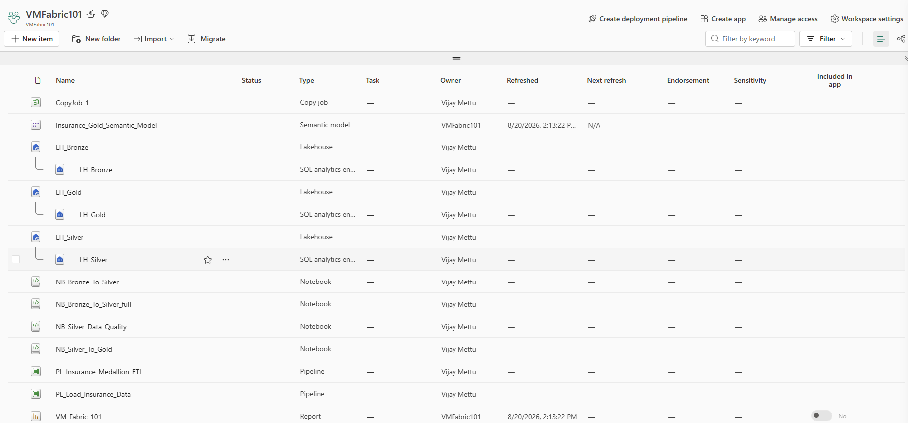
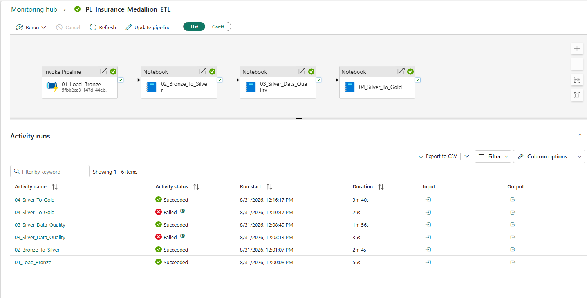
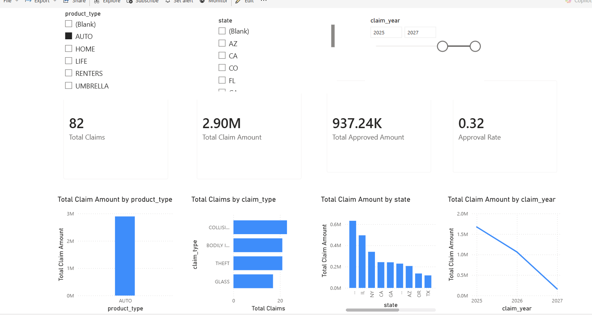

# Microsoft Fabric Insurance Medallion Analytics Platform


-b5651d)


[](https://github.com/Vijayreddymettu/fabric-insurance-medallion/actions/workflows/ci.yml)


End-to-end insurance data engineering and analytics platform built with **Microsoft Fabric**, implementing a production-oriented **Bronze → Silver → Gold Medallion Architecture**: incremental processing, Delta Lake, data-quality controls, dimensional modeling, Direct Lake semantic modeling, DAX analytics, row-level security, pipeline orchestration, operational monitoring, and Power BI reporting.

> **No public live-demo link.** This Fabric trial tenant has "Publish to web" and external sharing disabled at the admin level, outside this account's control. The [screenshots](#2a-live-workspace-evidence) below are direct evidence of the workspace, dashboard, and pipeline execution. Workspace and lakehouse GUIDs in the pipeline and semantic-model definitions have been replaced with zero-GUIDs.

---

## Contents

- **Overview** — [Business Scenario](#1-business-scenario) · [End-to-End Architecture](#2-end-to-end-architecture) · [Live Workspace Evidence](#2a-live-workspace-evidence) · [Technology Stack](#3-technology-stack)
- **Engineering** — [Medallion Data Architecture](#4-medallion-data-architecture) · [Incremental Processing](#5-incremental-processing-framework) · [Delta MERGE & Idempotency](#6-delta-merge-and-idempotency) · [Data Quality Gate](#7-data-quality-gate) · [Referential Integrity](#8-referential-integrity-and-unknown-members) · [Gold Star Schema](#9-gold-star-schema) · [Reconciliation & Audit](#10-reconciliation-audit-and-persistence-validation)
- **Orchestration** — [Pipeline Orchestration](#11-production-pipeline-orchestration) · [Retry & Timeout Hardening](#12-retry-and-timeout-hardening) · [Scheduling](#13-scheduling) · [Operational Monitoring](#14-operational-monitoring-and-capacity-failure-testing)
- **Semantic & BI** — [Direct Lake Semantic Model](#15-direct-lake-semantic-model) · [Relationships](#16-semantic-model-relationships) · [DAX Measures](#17-dax-business-measures) · [Time Intelligence](#18-time-intelligence) · [Row-Level Security](#19-row-level-security) · [Power BI Analytics](#20-power-bi-executive-analytics) · [SQL Analytics](#21-sql-analytics)
- **Reference** — [Repository Structure](#22-repository-structure) · [Key Architecture Decisions](#23-key-architecture-decisions) · [Tested End-to-End](#24-implemented-and-end-to-end-tested) · [Future Enhancements](#25-future-production-enhancements) · [Interview Narrative](#26-interview-architecture-narrative)
- **Deeper docs** — [`docs/`](docs/README.md) · [`architecture/`](architecture/README.md)

## Reproduce This Project

1. Create a Microsoft Fabric workspace and three Lakehouses: `LH_Bronze`, `LH_Silver`, `LH_Gold`.
2. Import the notebooks from [`notebooks/`](notebooks/) and bind each to its default Lakehouse.
3. Import the pipelines from [`pipelines/`](pipelines/) — `PL_Load_Insurance_Data` (ingestion) and `PL_Insurance_Medallion_ETL` (orchestration).
4. Run `NB_01_ETL_Control_Framework` once to seed the control table, then run `PL_Insurance_Medallion_ETL`.
5. Deploy [`semantic-model/Insurance_Gold_Semantic_Model.tmdl`](semantic-model/) against `LH_Gold`, repointing the OneLake source to your workspace/lakehouse IDs.
6. Open the report in [`powerbi/`](powerbi/) and repoint its live connection to your semantic model.

---

## 1. Business Scenario

The platform integrates insurance data across four primary business domains:

- Customers
- Policies
- Claims
- Payments

The objective is to transform operational insurance data into a governed, reusable analytical platform supporting executive reporting, claims analysis, payment analysis, and customer/policy analytics.

---

## 2. End-to-End Architecture

```mermaid
flowchart LR
    SRC["Insurance Sources<br/>Customers | Policies | Claims | Payments"]
    LOAD["PL_Load_Insurance_Data"]
    B["LH_Bronze<br/>Raw + Incremental"]
    BS["Bronze → Silver<br/>Watermark + Delta MERGE"]
    S["LH_Silver<br/>Cleansed + Standardized"]
    DQ["Silver Data Quality<br/>Validation + Rejects"]
    SG["Silver → Gold"]
    G["LH_Gold<br/>Star Schema"]
    SM["Direct Lake Semantic Model<br/>Relationships + DAX + RLS"]
    PBI["Power BI<br/>Insurance Executive Dashboard"]

    SRC --> LOAD --> B --> BS --> S --> DQ --> SG --> G --> SM --> PBI
```



The complete workflow is orchestrated through:

`PL_Insurance_Medallion_ETL`

---

## 2a. Live Workspace Evidence



The Fabric workspace (`VMFabric101`) above shows the actual artifacts this project produced: three Lakehouses (`LH_Bronze`, `LH_Silver`, `LH_Gold`), the incremental-processing notebooks, both pipelines (`PL_Load_Insurance_Data`, `PL_Insurance_Medallion_ETL`), the Direct Lake semantic model, and the published report — all inside a real Microsoft Fabric tenant, not a local simulation.

---

## 3. Technology Stack

- Microsoft Fabric
- OneLake
- Fabric Lakehouse
- Fabric Data Pipelines
- Fabric Notebooks
- Apache Spark
- PySpark
- Delta Lake / Delta tables
- SQL Analytics Endpoint
- Power BI
- Direct Lake
- DAX
- TMDL
- Row-Level Security
- Visual Studio Code
- Mermaid

---

# 4. Medallion Data Architecture

## Bronze — Raw and Replayable Data

Lakehouse:

`LH_Bronze`

Source-oriented insurance data is loaded through:

`PL_Load_Insurance_Data`

Bronze provides:

- Raw-data preservation
- Traceability
- Replay capability
- Incremental ingestion foundation
- Separation between source extraction and downstream transformation

Preserving Bronze allows downstream transformations to be rebuilt without repeatedly extracting data from source systems.

---

## Silver — Cleansed and Standardized Data

Silver Lakehouse:

`LH_Silver`

Bronze data is transformed using PySpark notebooks.

Processing includes:

- Schema standardization
- Data-type handling
- Business-key validation
- Deduplication
- Incremental processing
- Watermark-based processing
- Delta MERGE
- Reject handling
- Restart/idempotency behavior

The Silver layer acts as the reusable engineering layer for downstream business transformations.

---

# 5. Incremental Processing Framework

The project supports incremental processing rather than rebuilding every table during every execution.

Incremental notebooks include:

- `NB_01_ETL_Control_Framework`
- `NB_02_Customers_Incremental`
- `NB_03_Policies_Incremental`
- `NB_04_Claims_Incremental`
- `NB_05_Payments_Incremental`

The framework uses watermarks to determine which records need to be processed.

Conceptually:

```text
Read previous watermark
        ↓
Identify new/changed records
        ↓
Validate and deduplicate
        ↓
Delta MERGE into target
        ↓
Validate persistence
        ↓
Advance watermark
```

This design reduces unnecessary processing and provides the foundation for scalable production ingestion.

---

# 6. Delta MERGE and Idempotency

Incremental processing uses Delta Lake MERGE semantics to distinguish between existing and new business records.

Conceptually:

```text
Source incremental records
        ↓
Match business key
       / \
   MATCHED  NOT MATCHED
      ↓          ↓
   UPDATE       INSERT
```

This provides:

- Upsert behavior
- Reduced duplicate processing
- Repeatable pipeline execution
- Restartability
- Idempotent processing

A failed or repeated execution should not blindly duplicate previously processed business records.

---

# 7. Data Quality Gate

Notebook:

`NB_Silver_Data_Quality`

Data quality is implemented as an explicit architectural stage between Silver and Gold.

```text
Silver
   ↓
Data Quality Validation
   ↓
PASS ─────────→ Gold
FAIL ─────────→ Stop / Reject
```

Validation includes concepts such as:

- Required-field validation
- Business-key validation
- Duplicate detection
- Referential-integrity checks
- Reject handling
- Reconciliation checks

The Gold transformation runs only after the Silver data-quality stage succeeds.

This prevents invalid engineering data from silently propagating into executive analytics.

---

# 8. Referential Integrity and Unknown Members

The Gold transformation validates relationships between facts and dimensions.

Rather than allowing missing dimension references to break analytical integrity, the design supports **unknown-member handling**.

This allows unmatched business records to remain analytically visible while preserving star-schema relationships.

This is particularly important in production systems where source systems can arrive at different times or contain temporarily incomplete reference data.

---

# 9. Gold Star Schema

Gold Lakehouse:

`LH_Gold`

The Gold layer is optimized for analytical consumption.

## Dimensions

| Table            | Purpose                    |
| ---------------- | -------------------------- |
| `dim_customer` | Customer attributes        |
| `dim_policy`   | Policy/product attributes  |
| `dim_date`     | Shared analytical calendar |

## Facts

| Table            | Purpose                                        |
| ---------------- | ---------------------------------------------- |
| `fact_claim`   | Claim transactions and claim metrics           |
| `fact_payment` | Claim-payment transactions and payment metrics |

Conceptually:

```text
                    dim_customer
                         |
                         |
                    dim_policy
                    /       \
                   /         \
          fact_claim       fact_payment
              |                 |
              +---- dim_date ---+
```

Surrogate keys are used between Gold facts and dimensions to provide stable analytical relationships.

---

# 10. Reconciliation, Audit and Persistence Validation

The processing framework includes controls to validate that records survive each transformation stage correctly.

The solution incorporates concepts including:

- Source-to-target reconciliation
- Record-count validation
- Data-quality validation
- Audit information
- Watermark persistence
- Post-write validation
- Restart verification

These controls help distinguish between a technically successful Spark execution and a genuinely correct business-data load.

---

# 11. Production Pipeline Orchestration

Master pipeline:

`PL_Insurance_Medallion_ETL`

Execution flow:

```text
01_Load_Bronze
      ↓
02_Bronze_To_Silver
      ↓
03_Silver_Data_Quality
      ↓
04_Silver_To_Gold
```

Each downstream stage has a **Succeeded** dependency on its predecessor.

This provides fail-fast behavior and prevents invalid downstream execution.

---

## Pipeline Parameters

The master pipeline supports:

| Parameter         | Default         |
| ----------------- | --------------- |
| `p_run_mode`    | `INCREMENTAL` |
| `p_batch_id`    | `AUTO`        |
| `p_environment` | `DEV`         |

Notebook activities receive runtime values dynamically through Fabric expressions.

Examples:

```text
@pipeline().parameters.p_run_mode
@pipeline().RunId
@pipeline().parameters.p_environment
```

This separates runtime configuration from notebook implementation.

---

# 12. Retry and Timeout Hardening

Pipeline activities include explicit retry policies.

Current implementation:

| Activity                   |  Timeout | Retries | Retry Interval |
| -------------------------- | -------: | ------: | -------------: |
| `01_Load_Bronze`         | 12 hours |       3 |        100 sec |
| `02_Bronze_To_Silver`    | 12 hours |       3 |        100 sec |
| `03_Silver_Data_Quality` | 12 hours |       3 |        300 sec |
| `04_Silver_To_Gold`      | 12 hours |       3 |        300 sec |

Example exported Fabric policy:

```json
{
  "timeout": "0.12:00:00",
  "retry": 3,
  "retryIntervalInSeconds": 300
}
```

Longer retry intervals are particularly useful for Spark notebook activities when Fabric capacity is temporarily constrained.

---

# 13. Scheduling

A schedule was configured for the master pipeline to demonstrate production scheduling.

The schedule was subsequently disabled in the development/demo environment to avoid consuming Fabric trial/capacity resources unnecessarily.

The orchestration design supports scheduled incremental execution.

---

# 14. Operational Monitoring and Capacity Failure Testing

During end-to-end testing, Fabric returned:

`TooManyRequestsForCapacity — HTTP 430`

The failure occurred while Fabric attempted to create a Spark/Livy notebook session.

This was an **infrastructure/capacity condition**, not a transformation-code or data-quality failure.

The project therefore provided practical experience distinguishing:

```text
Application / transformation failure
             vs.
Data-quality failure
             vs.
Platform / capacity failure
```

Fabric Monitoring was used to inspect pipeline and notebook executions.



The activity-run history above is real evidence of the retry design in action: both `03_Silver_Data_Quality` and `04_Silver_To_Gold` failed once (12:03:13 PM and 12:10:47 PM respectively) and succeeded on the automatic retry a few minutes later, with the full pipeline canvas showing all four stages green (`Succeeded`) end to end. This is a stronger artifact than a clean first-try run — it shows the retry/idempotency design actually recovering from a real failure, not just working when nothing goes wrong.

After capacity became available, the pipeline successfully completed the complete sequence through Gold.

This validates the importance of:

- Retry policies
- Monitoring
- Idempotent processing
- Restartability
- Capacity awareness

---

# 15. Direct Lake Semantic Model

Current semantic model:

`Insurance_Gold_Semantic_Model`

The model consumes the Gold Lakehouse using **Direct Lake**.

Direct Lake provides Power BI semantic-model functionality over Fabric/OneLake data without requiring the traditional full import-copy pattern.

The semantic model contains five core tables:

```text
dim_customer
dim_date
dim_policy
fact_claim
fact_payment
```

The model definition is preserved as:

`semantic-model/Insurance_Gold_Semantic_Model.tmdl`

---

# 16. Semantic Model Relationships

The model uses controlled many-to-one relationships with single-direction filtering.

Key relationships include:

```text
dim_policy[customer_key]
        → dim_customer[customer_key]

fact_claim[claim_date_key]
        → dim_date[date_key]

fact_claim[policy_key]
        → dim_policy[policy_key]

fact_payment[payment_date_key]
        → dim_date[date_key]

fact_payment[policy_key]
        → dim_policy[policy_key]
```

This maintains a predictable star-schema filtering pattern and avoids unnecessary bidirectional-filter ambiguity.

---

# 17. DAX Business Measures

The semantic model contains approximately **33 reusable measures** organized into business-oriented display folders.

## Claims

Examples include:

- Claim Count
- Total Claim Amount
- Total Approved Amount
- Average Claim Amount
- Approval Rate
- Approved Amount %
- Unapproved Amount %
- Outstanding Claim Amount
- Outstanding Claim %
- Open Claim Count
- Open Claim Amount
- Closed Claim Count
- Closed Claim Amount
- Claims per Customer

## Payments

Examples include:

- Payment Count
- Total Payments
- Average Payment Amount
- Completed Payment Count
- Pending Payment Count
- Paid-to-Claim Ratio
- Unmatched Payment Dates

## Customers

- Customer Count

## Policies

Examples include:

- Policy Count
- Active Policy Count
- Total Annual Premium
- Average Annual Premium
- Claims per Policy
- Loss Ratio

Centralizing these calculations in the semantic layer prevents business logic from being recreated independently across reports.

---

# 18. Time Intelligence

The shared `dim_date` dimension supports reusable time intelligence.

Implemented measures include:

### Claims

- Total Claim Amount YTD
- Total Claim Amount PY
- Claim Amount YoY %

### Payments

- Total Payments YTD
- Total Payments PY
- Payment YoY %

The date dimension includes analytical attributes such as:

- Date
- Year
- Quarter
- Month
- Year-Month
- Week
- Day
- Weekend indicator

This provides a reusable enterprise-style calendar rather than embedding date logic inside individual visuals.

---

# 19. Row-Level Security

A security role was created:

`NY_State_Access`

The role applies a filter on:

`dim_customer[state] = "NY"`

The existing semantic-model relationships allow the customer security context to propagate into related policy, claim and payment analytics.

This demonstrates semantic-model security independently of report-level filters.

---

# 20. Power BI Executive Analytics

Current report:

`Insurance Executive Dashboard`

The report is connected to:

`Insurance_Gold_Semantic_Model`

The downloaded PBIX uses a **live connection to the Fabric semantic model** because the underlying semantic model uses Direct Lake.

Current artifact:

`powerbi/Insurance_Executive_Dashboard.pbix`



---

## Report Pages

The report contains four analytical pages:

### 1. Executive Overview

Provides high-level insurance KPIs including:

- Total Claim Amount
- Total Payments
- Outstanding Claim Amount
- Approved Amount %
- Total Annual Premium

It also includes trend and categorical analysis across claim status, claim type, payment status and state.

### 2. Claims Analysis

Provides deeper analysis of:

- Claim volume
- Claim amount
- Approval behavior
- Claim status
- Claim type
- Product and geographic patterns

### 3. Payments Analysis

Provides analysis of:

- Total payments
- Payment counts
- Payment status
- Payment trends
- Claim/payment relationships

### 4. Customer & Policy Analysis

Provides metrics including:

- Customer Count
- Policy Count
- Active Policy Count
- Total Annual Premium
- Average Annual Premium
- Policy status
- Product type
- Claims per Policy
- Customer distribution by state

---

# 21. SQL Analytics

The Gold Lakehouse is accessible through the Fabric SQL Analytics Endpoint.

Example SQL:

`sql/01_gold_analytics.sql`

The SQL examples demonstrate:

- Gold-table validation
- Fact/dimension joins
- Product-level analytics
- State-level analytics
- Time-based analytics
- Business-friendly analytical queries

This provides an additional SQL consumption path over the same governed Gold data used by Power BI.

---

# 22. Repository Structure

```text
Fabric-Insurance-Medallion/
│
├── architecture/
│
├── docs/
│   └── reference/          # source .docx material
│
├── notebooks/
│   ├── NB_01_ETL_Control_Framework.ipynb
│   ├── NB_02_Customers_Incremental.ipynb
│   ├── NB_03_Policies_Incremental.ipynb
│   ├── NB_04_Claims_Incremental.ipynb
│   ├── NB_05_Payments_Incremental.ipynb
│   ├── NB_Bronze_To_Silver_full.ipynb
│   ├── NB_Silver_Data_Quality.ipynb
│   └── NB_Silver_To_Gold.ipynb
│
├── pipelines/
│   ├── PL_Insurance_Medallion_ETL/
│   │   ├── manifest.json
│   │   └── PL_Insurance_Medallion_ETL.json
│   │
│   └── PL_Load_Insurance_Data/
│       ├── manifest.json
│       └── PL_Load_Insurance_Data.json
│
├── powerbi/
│   ├── Insurance_Executive_Dashboard.pbix
│   ├── Insurance_Executive_Dashboard_2026-08-24.pbix
│   └── VM_Fabric_101.pbix
│
├── screenshots/
│
├── semantic-model/
│   └── Insurance_Gold_Semantic_Model.tmdl
│
├── sql/
│   └── 01_gold_analytics.sql
│
└── README.md
```

---

# 23. Key Architecture Decisions

## Separate ingestion from transformation

Fabric pipelines handle orchestration while Spark notebooks contain transformation logic.

This reduces coupling and improves maintainability.

## Preserve Bronze

Raw source data remains replayable so downstream transformations can be rebuilt without repeated source extraction.

## Incrementally process Silver

Watermarks and Delta MERGE reduce unnecessary processing and support scalable recurring loads.

## Make processing idempotent

Restarting or repeating a batch should not blindly duplicate business records.

## Use an explicit quality gate

Silver data must pass validation before Gold processing begins.

## Protect referential integrity

Unknown-member handling prevents late or incomplete dimension data from silently breaking fact analysis.

## Model Gold as a star schema

Facts and dimensions provide a business-oriented analytical structure instead of exposing operational source schemas directly.

## Centralize business logic

DAX measures reside in the semantic model so all reports consume consistent business definitions.

## Use a shared date dimension

Time intelligence is implemented once and reused across claims and payments.

## Use single-direction relationships

Predictable dimension-to-fact filtering reduces semantic ambiguity.

## Apply security at the semantic layer

RLS provides reusable data access control independently of individual report visuals.

## Harden orchestration

Retries, timeouts, parameters, dependency management and monitoring improve production reliability.

---

# 24. Implemented and End-to-End Tested

The following capabilities are implemented rather than theoretical future enhancements:

- Bronze / Silver / Gold architecture
- Incremental processing
- Watermark management
- Delta MERGE
- Business-key deduplication
- Reject handling
- Restart/idempotency
- Data-quality gate
- Referential-integrity validation
- Unknown-member handling
- Gold star schema
- `dim_customer`
- `dim_policy`
- `dim_date`
- `fact_claim`
- `fact_payment`
- Reconciliation
- Audit/persistence validation
- Pipeline parameters
- Retry policies
- Activity timeouts
- Scheduling
- Pipeline monitoring
- Capacity-failure recovery testing
- Direct Lake semantic model
- Star-schema relationships
- DAX business measures
- Time intelligence
- Row-Level Security
- Multi-page Power BI executive dashboard
- SQL Analytics Endpoint consumption
- TMDL model source
- VS Code project structure

---

# 25. Future Production Enhancements

Areas that could extend the current implementation include:

- Source-system CDC integration
- Metadata-driven ingestion configuration
- Metadata-driven data-quality rules
- Enterprise alerting and incident integration
- Central operational observability dashboard
- SLA/freshness alerting
- Sensitivity labels and broader governance
- Microsoft Purview integration
- DEV / TEST / PROD deployment strategy
- Fabric deployment pipelines
- Git-based CI/CD
- Automated testing
- Capacity sizing and workload optimization
- Disaster-recovery procedures

These are extensions to the implemented architecture rather than substitutes for the functionality already completed.

---

# 26. Interview Architecture Narrative

> I built an end-to-end insurance analytics platform in Microsoft Fabric using a Bronze, Silver and Gold Medallion Architecture. Customer, policy, claim and payment data is ingested into a replayable Bronze Lakehouse. From there, incremental PySpark processing uses watermarks, business-key deduplication and Delta MERGE to maintain standardized Silver tables.
>
> Before data reaches the analytical layer, I introduced a dedicated data-quality gate with validation, reject handling and referential-integrity controls. The Gold layer is modeled as a star schema with customer, policy and date dimensions supporting claim and payment facts. I also implemented unknown-member handling, reconciliation and persistence validation so successful execution means the data is actually consistent, not merely that the Spark job finished.
>
> The entire process is orchestrated through a master Fabric pipeline with runtime parameters, success dependencies, retries, explicit timeouts, scheduling and monitoring. During testing I encountered Fabric HTTP 430 capacity failures when Livy sessions could not be created. Because the processing was restartable and idempotent, the pipeline could recover and subsequently complete successfully without corrupting the analytical state.
>
> On top of Gold, I built a Direct Lake Power BI semantic model with controlled star-schema relationships, reusable DAX measures, a shared date dimension, YTD/previous-year/YoY time intelligence and row-level security. The final four-page Power BI report provides executive, claims, payments, and customer/policy analytics.
>
> The important point is that I didn't treat Fabric as just a notebook environment or Power BI as just visualization. I built the flow as a complete data platform—from ingestion and incremental engineering through quality, dimensional modeling, orchestration, semantic modeling, security and business consumption.

---

# 27. End-to-End Flow to Remember

```text
SOURCE
   ↓
BRONZE
Raw + replayable
   ↓
INCREMENTAL FRAMEWORK
Watermark + deduplication
   ↓
SILVER
Standardized Delta tables
   ↓
DATA QUALITY
Validate + reject + reconcile
   ↓
GOLD
Dimensions + facts
   ↓
SEMANTIC MODEL
Direct Lake + relationships + DAX + RLS
   ↓
POWER BI
Executive + Claims + Payments + Customer/Policy
   ↓
OPERATIONS
Parameters + retries + timeout + schedule + monitoring
```

A concise memory pattern for interviews is:

**Ingest → Increment → Clean → Validate → Model → Orchestrate → Secure → Analyze → Monitor**

---

## Documentation

| Area | Location |
| --- | --- |
| Deep-dive docs (overview, data flow, design decisions, interview prep) | [`docs/`](docs/README.md) |
| Architecture diagram and narrative | [`architecture/`](architecture/README.md) |
| Fabric notebooks (ingestion, incremental, DQ, Gold) | [`notebooks/`](notebooks/) |
| Data pipeline definitions | [`pipelines/`](pipelines/) |
| Direct Lake semantic model (TMDL) | [`semantic-model/`](semantic-model/) |
| SQL analytics examples | [`sql/`](sql/) |
| Power BI report | [`powerbi/`](powerbi/) |
| Screenshots / execution evidence | [`screenshots/`](screenshots/) |

## License

**All Rights Reserved © Vijay Mettu**

In plain English: this code is public so you can read it and see how it's built,
but you don't have permission to copy, modify, deploy, or sell it — for that, ask
first. See [LICENSE](LICENSE) for the full terms.
