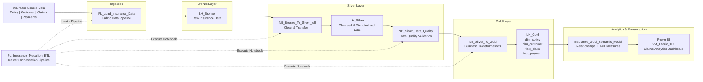

```mermaid
flowchart LR

    SRC["Insurance Source Data<br/>Policy | Customer | Claims | Payments"]

    subgraph ING["Ingestion"]
        LOAD["PL_Load_Insurance_Data<br/>Fabric Data Pipeline"]
    end

    subgraph B["Bronze Layer"]
        LB["LH_Bronze<br/>Raw Insurance Data"]
    end

    subgraph S["Silver Layer"]
        BS["NB_Bronze_To_Silver_full<br/>Clean & Transform"]
        LS["LH_Silver<br/>Cleansed & Standardized Data"]
        DQ["NB_Silver_Data_Quality<br/>Data Quality Validation"]
    end

    subgraph G["Gold Layer"]
        SG["NB_Silver_To_Gold<br/>Business Transformations"]
        LG["LH_Gold<br/>dim_policy<br/>dim_customer<br/>fact_claim<br/>fact_payment"]
    end

    subgraph C["Analytics & Consumption"]
        SM["Insurance_Gold_Semantic_Model<br/>Relationships + DAX Measures"]
        PBI["Power BI<br/>VM_Fabric_101<br/>Claims Analytics Dashboard"]
    end

    SRC --> LOAD
    LOAD --> LB
    LB --> BS
    BS --> LS
    LS --> DQ
    DQ --> SG
    SG --> LG
    LG --> SM
    SM --> PBI

    MASTER["PL_Insurance_Medallion_ETL<br/>Master Orchestration Pipeline"]

    MASTER -. "Invoke Pipeline" .-> LOAD
    MASTER -. "Execute Notebook" .-> BS
    MASTER -. "Execute Notebook" .-> DQ
    MASTER -. "Execute Notebook" .-> SG
```
